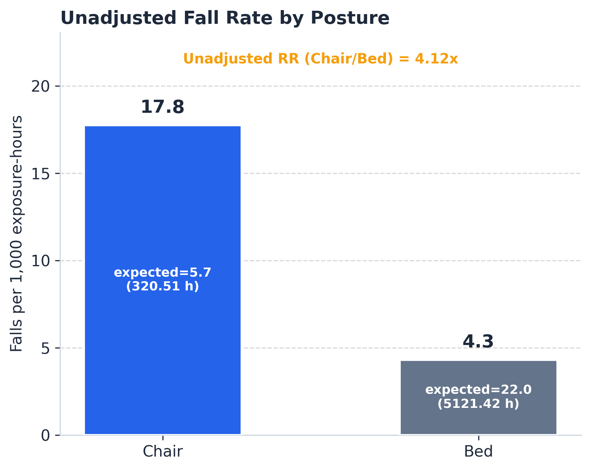
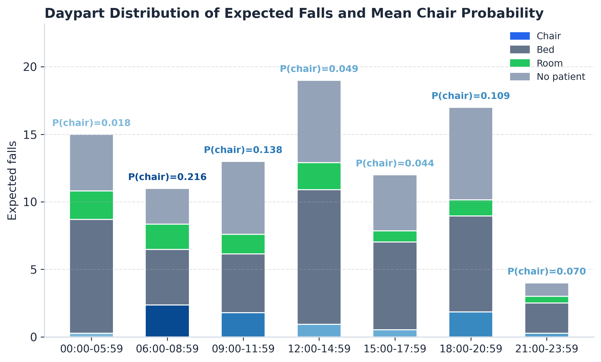

**Authors:** Paolo Gabriel (corresponding), Peter Rehani, Zack Drumm, Tyler Troy, Tiffany Wyatt, Narinder Singh

> _Submitted to IEEE Journal of Biomedical and Health Informatics — Sensor Informatics section. A preprint is available at [arXiv:2603.22785](https://arxiv.org/abs/2603.22785)._

# Overview

Hospital fall surveillance is conventionally reported per occupied bed-day — a denominator that conflates bed time, chair time, transfers, and ambulation. We replace that blended denominator with **probability-weighted position-specific exposure-hours** derived from per-hour computer-vision state estimates, and we propagate classifier label uncertainty into the downstream rate inference via systematic misclassification-sensitivity scenarios.

The result is a sensor-informatics methodology for translating probabilistic per-hour state estimates from continuous-monitoring deployments into rate inferences with explicit uncertainty propagation, applicable beyond fall surveillance to any deployment where state-label calibration is imperfect.


_Figure 1 of manuscript — descriptive chair vs bed fall rates per 1,000 exposure-hours among intervention-eligible monitor-units._

# Key Result

The headline numbers from a retrospective deployment spanning 11 hospitals (August 2024 – December 2025):

| Metric | Value |
|---|---|
| Eligible monitoring units | 3,980 |
| Intervention-eligible (fall-linked) units | 42 |
| Exposure (chair / bed) | 320.5 h / 5,121.4 h |
| Inferential fall events | 40 |
| Probability-weighted descriptive rate (chair / bed) | 17.8 / 4.3 per 1,000 exposure-hours |
| **Adjusted chair-vs-bed rate ratio** | **2.35 (HC3 95% CI 0.93–5.94; p = 0.071)** |
| Misclassification-sensitivity range | 4.49 – 13.17 across estimable swaps |

The HC3 confidence interval crosses 1.0; with 40 events the result is **hypothesis-generating, not confirmatory**. The misclassification-sensitivity panel quantifies how classifier label quality (macro F1 = 0.528; expected calibration error = 0.450) bounds the inferential strength.


_Forest plot of sensitivity analyses; full panel in the supplementary material._

# Methods at a Glance

- **Sensor stream:** continuous video-based patient monitoring across 11 hospitals; per-hour position fractions (chair / bed / room / no_patient / ambulatory) extracted from the platform's hourly cache.
- **Cohort:** outcome-defined intervention partition (42 fall-linked monitor-units) within 3,980 eligibility-passing units; estimand is the position-specific fall rate within this intervention cohort.
- **Exposure:** probability-weighted chair- and bed-exposure-hours summed across all hourly rows of the 42 intervention-eligible units (320.5 / 5,121.4).
- **Inference:** Poisson GLM with log-exposure offset; covariates for time-of-day window, day of week, calendar quarter, and division identifier; HC3 robust SE primary; division-clustered SE exploratory only (n = 9 divisions, below the 30-cluster threshold).
- **Uncertainty propagation:** pre-specified misclassification scenarios (symmetric 10/20/30% chair/bed swaps + one-sided 20% swaps) translate classifier label-quality bounds into rate-ratio bounds.


_Daypart distribution of expected falls and mean chair probability across seven local time windows (Figure 6 of manuscript)._

# Reproducibility

Every numeric value reported in the manuscript traces deterministically to a frozen run: `consensus_v3_refresh_20260320T215557Z` (fixture `frozen_v1`). The aggregate derived tables in [`data/public/derived/`](https://github.com/lookdeep/chair-falls-analysis/tree/main/data/public/derived) are sufficient inputs to regenerate the figures and tables; the upstream extract / transform / QA pipeline is shipped for transparency in [`scripts/`](https://github.com/lookdeep/chair-falls-analysis/tree/main/scripts) and [`src/`](https://github.com/lookdeep/chair-falls-analysis/tree/main/src) but raw video and patient-level intermediate tables are not redistributable under the existing Data Use Agreement.

Quick start (once you've cloned the repo):
```bash
uv venv
uv sync --project .
cp .env.example .env
just paper-build
```

See [`docs/reproduce_this_paper.md`](https://github.com/lookdeep/chair-falls-analysis/blob/main/docs/reproduce_this_paper.md) for the full walkthrough.

# Resources

_Links open in a new window._

- [GitHub repository](https://github.com/lookdeep/chair-falls-analysis) — analysis code, manuscript source, public data bundle
- [arXiv preprint](https://arxiv.org/abs/2603.22785) — current version
- [Manuscript .docx](https://github.com/lookdeep/chair-falls-analysis/raw/main/paper/build/manuscript.docx) — pre-rendered J-BHI submission
- [Supplementary material](https://github.com/lookdeep/chair-falls-analysis/raw/main/paper/build/supplement.docx) — full sensitivity panel, label-quality benchmark, multimodal-LLM benchmark, mechanism-coded observation cohort, furniture-origin analyses
- [STROBE supplement](https://github.com/lookdeep/chair-falls-analysis/raw/main/paper/build/strobe_supplement.docx) — STROBE checklist
- [Public data bundle](https://github.com/lookdeep/chair-falls-analysis/tree/main/data/public) — adjudicated annotations + frozen aggregate tables
- [LookDeep Health](https://lookdeep.health/technology/) — company website

# Citation

Citation block will be updated when the paper is accepted. For now, please cite the preprint:

```bibtex
@article{gabriel2026chairfalls,
  author        = {Gabriel, Paolo and Rehani, Peter and Drumm, Zack and
                   Troy, Tyler and Wyatt, Tiffany and Singh, Narinder},
  title         = {Exposure-Normalized Bed and Chair Fall Rates via
                   Continuous AI Monitoring},
  year          = {2026},
  eprint        = {2603.22785},
  archivePrefix = {arXiv},
  doi           = {10.48550/arXiv.2603.22785}
}
```

# Ethics

All video data was de-identified upstream via facial blurring and removal of direct identifiers; only AI-derived per-hour state estimates and aggregated counts enter the analytic dataset. Because no identifiable private information was obtained or analyzed, the study does not constitute human subjects research under 45 CFR 46.102(e)(1)(ii) and HIPAA Safe Harbor de-identification (45 CFR 164.514(b)) applies. No IRB review was required. The outcomes of this analysis did not influence patient care.

# Change Log

- **2026-04-30** — initial project page; manuscript submitted to IEEE J-BHI Sensor Informatics.
- **(pending)** — IEEE J-BHI publication URL, Zenodo DOI archive.
