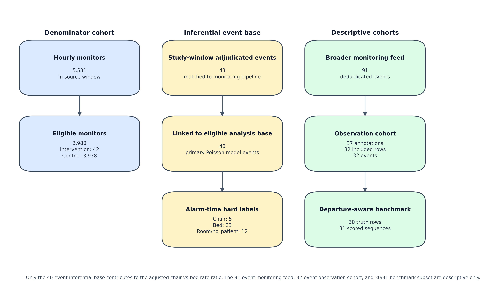
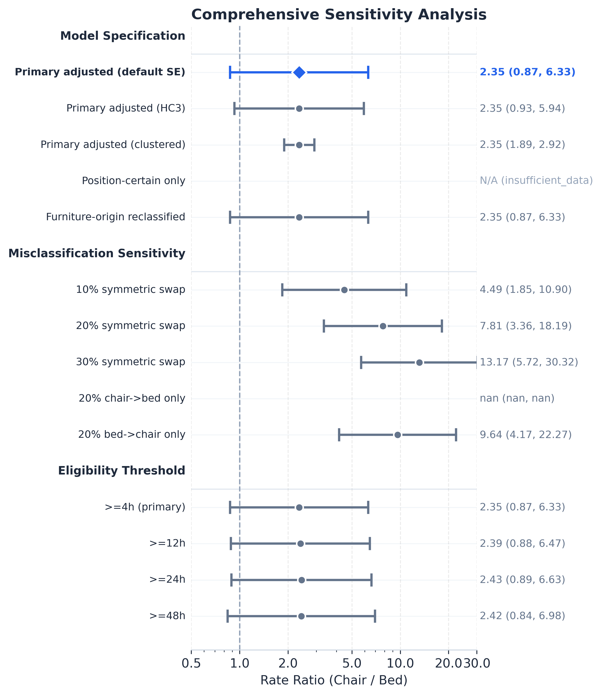

# Abstract

Inpatient fall surveillance reports rates per occupied bed-day, a denominator that conflates chair, bed, transfer, and ambulatory time and cannot resolve position-specific hazard. We extract per-hour chair and bed exposure fractions from continuous computer-vision patient monitoring deployed across 11 hospitals (August 2024–December 2025) and replace the bed-day denominator with probability-weighted position-specific exposure-hours. From 3,980 eligible monitor-units (292,914 hourly rows), 42 fall-linked intervention units contributed 320.5 chair-hours and 5,121.4 bed-hours; 40 adjudicated falls entered a Poisson rate model adjusted for time-of-day, day-of-week, calendar quarter, and division. Probability-weighted descriptive rates were 17.8 chair-falls and 4.3 bed-falls per 1,000 exposure-hours; the adjusted chair-vs-bed rate ratio was 2.35 (HC3-corrected 95% CI 0.93–5.94; p=0.071). Position-label uncertainty (macro F1 = 0.528; expected calibration error = 0.450) bounds the inferential strength: misclassification sensitivity scenarios produced rate ratios spanning 4.49–13.17, indicating a hypothesis-generating rather than confirmatory result. The methodological contribution is a CV-derived denominator framework that surfaces position-specific hazard invisible to standard surveillance and identifies improved position-label calibration as a prerequisite for confirmatory inference in continuous-monitoring contexts.

*Index Terms* — patient monitoring; computer vision; fall risk assessment; healthcare informatics; sensor data analysis.

# Introduction

Continuous video-based patient monitoring systems are increasingly deployed across hospital networks to support virtual-observer workflows for high-fall-risk patients [@gabriel2025; @jones2021; @sosa2024]. These systems generate dense, sub-minute streams of computer-vision-derived state estimates — position, motion, alarm signals — across thousands of monitored rooms. The data product is a sensor-informatics asset that, in principle, exposes operational and risk information at a temporal and spatial resolution unavailable to standard incident-reporting infrastructure. In practice, downstream use of these streams for outcome-rate measurement is constrained by two unresolved sensor-informatics problems: (i) how exposure denominators should be derived from probabilistic per-hour state estimates, and (ii) how rate inferences should be qualified when the underlying classifier has measurable label uncertainty.

Inpatient fall surveillance illustrates the cost of an unresolved denominator problem. Hospital fall metrics are conventionally reported per 1,000 occupied bed-days [@pressganey2026], a denominator that merges bed time, chair time, transfers, and ambulation into a single exposure bucket. The merge erases position-specific hazard: a fall from a chair is counted against bed-time, blurring the signal that distinguishes chair-seated from bed-bound risk [@jonesaltman2025]. The conceptual fix — replace the bed-day denominator with position-specific exposure time — is straightforward, but operationalizing it requires (a) reliable per-hour position fractions from a classifier, (b) a probabilistic event-allocation rule, and (c) explicit propagation of label uncertainty into the estimated rate ratio.

This work formulates and evaluates that pipeline on a retrospective continuous-monitoring deployment spanning 11 hospitals. The technical contributions are: (1) a probability-weighted exposure-hour denominator framework derived from CV per-hour state estimates; (2) a Poisson rate model adjusted for time, day-of-week, calendar quarter, and division identifier, with HC3 robust standard errors as the primary uncertainty estimator; and (3) systematic misclassification-sensitivity scenarios that bound the inferential strength of the rate estimate as a function of label-quality assumptions. Inpatient falls (acute-care prevalence: [@sanchez2025; @heikkila2023]; ongoing safety priority: [@jointcommission2026; @ecri2024; @worldguidelines2022; @dykes2024]) provide the application context; the headline finding (chair-vs-bed adjusted rate ratio 2.35; 95% CI 0.93–5.94) is interpreted as hypothesis-generating evidence for what an improved denominator can surface, not a confirmatory clinical effect. The contribution to J-BHI's Sensor Informatics scope is methodological: a reusable denominator-first measurement framework for continuous-monitoring deployments, with explicit characterization of where label-quality bounds inferential strength.

# Methods

## Study Design and Setting

This was a retrospective observational cohort study using continuous AI patient-monitoring data from a regional hospital network (11 hospitals, three U.S. states), analyzed at the division level over August 2024 – December 2025. The study is a secondary analysis of de-identified monitoring records under an existing data use agreement; no new data collection occurred. Reporting is informed by STROBE for cohort studies. See "Ethical Considerations" for de-identification and human-subjects-research determination.

## Data Source

The AI monitoring platform continuously processes room-level video feeds and assigns probabilistic position estimates for each monitored patient.[@gabriel2025] Within participating hospitals, the platform functioned as a virtual observer workflow for selected high fall-risk patients under routine operations.[@jones2021; @sosa2024] Per-hour position fractions ("pct_chair," "pct_bed," "pct_ambulatory") were extracted from the hourly monitoring cache using a pre-specified study-window filter and percentage-sum constraint. The extraction yielded 356,391 hourly rows with a valid position-percentage sum of 100% across all rows. Fall events were identified from AI-detected alarm records and linked to the hourly exposure structure via monitor and date-hour keys.

## Cohort Definition and Eligibility

A monitoring unit was a unique monitor. Units were classified as intervention-type if the monitor appeared in the extracted fall-event source, or control-type otherwise; this outcome-defined partition was derived deterministically from the source extracts. Eligibility required ≥4 observed monitor-hours (`min_observed_hours=4`) and a position-coverage ratio ≥0.95. Of 5,531 units, 3,980 passed both gates (intervention: 42 eligible; control: 3,938 eligible). The monitoring system is operationally deployed in hospital units serving patient populations identified as high fall-risk via standard clinical screening (e.g., the Hendrich II model);[@hendrich2020; @chang2024] patient-level risk scores were not available for this analysis. The primary analysis used only the 42 intervention-eligible units. The estimand is the position-specific fall rate within this outcome-defined intervention cohort; reported rates and the adjusted RR should not be interpreted as system-wide rates across all 3,980 eligible monitoring units.

This outcome-defined partition means only monitors with at least one recorded fall contribute exposure hours to the adjusted model, concentrating both chair and bed exposure in fall-experienced units. The directional effect on the estimated RR is uncertain: if fallen units are systematically higher in chair exposure than non-fallen units, restricting to them could inflate the chair rate while leaving the bed rate relatively stable, which would inflate the RR. Alternatively, if fallen units have proportionally more bed exposure, the bias could attenuate the RR. Because chair exposure per unit is typically shorter than bed exposure in high-fall-risk monitoring contexts, restriction to fallen units may reduce chair-hour denominators more than bed-hour denominators, with uncertain net effect. A sensitivity analysis using all eligible units (intervention + control) as the combined exposure denominator is a natural prospective extension but was not estimable from the current extraction without patient-level acuity linkage.

## Exposure Measurement

Patient exposure was expressed in fractional person-hours by position type. For each eligible hourly row, the chair exposure contribution equaled `pct_chair` hours and the bed exposure contribution equaled `pct_bed` hours, where `pct_chair` and `pct_bed` are fractional values in [0, 1] representing the share of that hour spent in each position. Intervention-eligible units are those classified as intervention-type, which by construction are monitors linked to at least one fall event in the source extract; all hourly rows from those 42 units contribute to exposure, not only the fall-event rows. Total exposure was aggregated across all intervention-eligible unit-hours in the analysis scope (i.e., all hourly rows from the 42 outcome-defined intervention monitors, not only the hours containing a fall event), yielding 320.51 chair-hours and 5,121.42 bed-hours. The analysis base comprised 292,914 rows after eligibility filtering.

## Secondary Operational Signal Analysis

A secondary analysis characterized workflow burden in a talk-confirmed subset (sessions with ≥1 `talk_clicked` audit-log event, passing the same eligibility gates), yielding 348.79 chair-hours and 5,351.70 bed-hours. The talk-confirmed subset is drawn from a different eligibility pass than the primary analysis base; its exposure totals are not expected to match and may exceed the primary base values. Talk-click and manual alarm events were assigned to chair or bed via modal non-missing location in a ±3 s window (±5 s sensitivity check); nudge activity was summarized as active seconds per exposure-hour. These signals are descriptive proxies and were not included in the primary model.

## Fall Ascertainment

Within the study window, 43 adjudicated fall events matched the monitoring pipeline; 40 linked to eligible analysis-base hours and entered the primary analysis. Hard labels (chair, bed, room, no_patient) were assigned from the patient's AI-detected position at alarm time and used for descriptive counts. For adjusted modeling, each eligible event contributed probabilistic chair/bed mass from pre-fall position probabilities within the linked unit-hour stratum; of the 40 inferential events, 28 had hard labels in {chair, bed}, and 12 arose from room/no_patient probability mass. A broader monitoring feed (2022–2026, n=91 events) was retained for descriptive context only.

{ width=95% }

## Statistical Analysis

Unadjusted fall rates were calculated as events per 1,000 exposure-hours by position.[@ahrq2013] For inferential analyses, we modeled fall rates using a Poisson GLM with a log link and an offset term log(exposure_hours). The outcome for each position-unit-time stratum was the count of proportionally allocated fall events; fractional counts arise when a single event's risk time spans multiple strata, and the model is interpreted as a log-linear working mean model for rate estimation rather than a strict Poisson count model. The primary covariate was patient position (chair vs bed; reference = bed). Covariates included seven fixed local clock-time windows, day of week, calendar quarter, and division identifier, chosen a priori based on literature describing time-varying and unit-level fall-risk variation.[@lee2023] The adjusted rate ratio (RR) was exp(β_chair); 95% CIs were constructed on the log-RR scale and exponentiated. Covariate table CIs use Wald standard errors; only the position coefficient of interest uses HC3.

Underdispersion (deviance/df = 0.13) is expected because fall_count is a probability-weighted fractional allocation; this mechanically shrinks stratum-level variance below integer-count levels and does not indicate model misfit. Pre-specified sufficiency checks required overdispersion ratios ≤1.5 (deviance/df and Pearson χ²/df), model convergence, and at least 5 events per position arm. When checks passed, primary inference used heteroskedasticity-consistent (HC3-type) robust standard errors (a variance estimator robust to model misspecification); division-level clustered SEs were a labeled exploratory sensitivity. If overdispersion exceeded 1.5, a negative binomial fallback was fit; adjusted RRs were reported only when all criteria were met, otherwise labeled not estimable. All analyses used Python `statsmodels` (v0.14.x).

## Sensitivity Analyses

Pre-specified sensitivity analyses addressed (i) time-window restriction across seven local-time strata; (ii) position-certainty restriction to hourly rows where chair or bed fraction ≥0.50; (iii) symmetric and one-sided label-swap misclassification scenarios; and (iv) eligibility-threshold variation at `min_observed_hours` ∈ {4, 12, 24, 48}. The full sensitivity panel is reported in the supplementary material; the headline table in the main text reports only the primary HC3-corrected estimate and an eligibility-threshold robustness row.

## Auxiliary Analyses (Supplement)

Four ancillary analyses are reported in the supplementary material to keep the main text focused on the primary rate estimate. The auxiliary analyses are: (i) automated label quality on the departure-aware benchmark subset; (ii) a multimodal-LLM benchmark on a 3-way overlap subset; (iii) a mechanism-coded observation cohort assembled by structured dual review; and (iv) furniture-exit detection concordance, which was non-estimable on this extraction due to a data-availability gap. None of these inputs enter the primary Poisson model; results are summarized in the Discussion only where they bound interpretation of the primary estimate.

# Results

The following subsections report unadjusted descriptive rates, the primary adjusted rate ratio, sensitivity analyses, and secondary descriptive findings. Cohort summary statistics are in Table 1.

**Table 1. Cohort summary statistics for the chair-falls retrospective cohort analysis.**

  ----------------------------------------------------------- ---------------------------------------------------------
  **Parameter**                                               **Value**

  Health system                                               [Regional Health System] (analyzed at division level)

  Study period                                                August 2024 - December 2025

  Total monitors (hourly data)                                5,531

  Total monitors (cohort map)                                 5,570

  Eligible monitors (both gates)                              3,980 / 5,531 (72.0%)

  Intervention-eligible                                       42

  Control-eligible                                            3,938

  Ineligible monitors                                         1,551

  Intervention-ineligible                                     5

  Control-ineligible                                          1,546

  Total hourly exposure rows (valid)                          356,391

  Analysis base rows (after eligibility)                      292,914

  Study-window adjudicated events matched to pipeline         43

  Inferential fall events linked to analysis base             40

  Broader monitoring feed (2022-2026, descriptive only)       91

  Broader observation cohort (descriptive mechanism coding)   32 deduplicated events

  Departure-aware benchmark subset                            30 truth rows / 31 scored sequences

  Eligibility gates applied                                   min_observed_hours=4; min_coverage_ratio=0.95

  Primary model                                               Poisson GLM; offset=log(exposure_hours)

  Patient-level linkage                                       Not available; monitor may serve multiple patients across study window
  ----------------------------------------------------------- ---------------------------------------------------------

## Descriptive Fall Rates by Position (Unadjusted)

Among intervention-eligible units, the probability-weighted descriptive chair fall rate was 17.8 per 1,000 exposure-hours (5.69 expected event mass / 320.51 chair-exposure-hours) and the corresponding bed rate was 4.3 per 1,000 exposure-hours (22.05 expected event mass / 5,121.42 bed-exposure-hours). Hard-label rates are shown alongside for transparency (chair 15.6; bed 4.5 per 1,000 exposure-hours), but the probability-weighted rates better match the event allocation used in adjusted modeling. The 40 inferential events comprise 28 hard-label event counts in {chair, bed} (5 chair, 23 bed) and 12 hard-label event counts in {room, no_patient}; all 40 enter the model via probability-weighted allocation across positions, distributing as 5.69 expected mass on chair and 22.05 on bed (chair+bed total 27.74), with the residual 12.26 expected mass distributed across room/ambulatory/no_patient strata.

{ width=85% }

**Table 2. Unadjusted fall rates by patient position, intervention-eligible units.**

  -------------- ----------------------------------- ---------------------- ---------------------- ----------------------------------------------------------
  **Position**   **Hard-label event count (n)**      **Exposure (hours)**   **Rate per 1,000 h**   **Rate from probability-weighted expected mass (per 1,000 h)**

  Chair          5                                   320.51                 15.6                   17.8

  Bed            23                                  5,121.42               4.5                    4.3
  -------------- ----------------------------------- ---------------------- ---------------------- ----------------------------------------------------------

> Note: "Hard-label event count (n)" reflects integer counts of events whose AI-assigned position at alarm time falls in {chair, bed}; the remaining 12 of 40 inferential events have hard labels in {room, no_patient} and are not shown here. The "rate from probability-weighted expected mass" column uses fractional event mass derived from pre-fall location probabilities (chair expected mass 5.69; bed 22.05; chair+bed total 27.74; residual 12.26 allocated to room/ambulatory/no_patient strata, summing to 40.00 across all positions). All 40 inferential events enter the adjusted Poisson model via this probability-weighted allocation. Analysis restricted to intervention-eligible units only (n=42 intervention monitors in analysis base).

## Primary Adjusted Relative Risk

The primary adjusted chair-vs-bed RR was 2.35 (HC3-corrected Wald 95% CI 0.93 to 5.94; p=0.071); the Wald-companion estimate was 2.35 (95% CI 0.87 to 6.33; p=0.091). A division-clustered exploratory fit yielded the same point estimate with narrower interval (1.89 to 2.92; p<0.0001) but is not the primary estimate (9 intervention divisions, below the conventional ≥30-cluster threshold for asymptotic cluster-robust inference; underdispersed fit, deviance/df = 0.13). Position-certainty restriction was non-estimable; negative-binomial fallback was not triggered.

## Sensitivity Analyses

**Table 3. Primary adjusted rate ratio and headline sensitivity (full sensitivity panel in supplement).**

  ------------------------------------- -------- -------------- ------------- ---------------- ----------------------------------------------------
  **Analysis**                          **RR**   **95% CI**     **p-value**   **Events (n)**   **Notes**

  Primary — HC3 SE (all hours)          2.35     0.93 to 5.94   0.071         40               estimable; HC3 robust SE primary

  Eligibility threshold ≥ 24 h          2.43     0.89 to 6.63   0.083         36               eligibility-floor robustness
  ------------------------------------- -------- -------------- ------------- ---------------- ----------------------------------------------------

> Note: RR, rate ratio; CI, confidence interval; HC3, heteroskedasticity-consistent robust SE (primary). Eligibility-threshold variants at 12 h, 24 h, and 48 h, the Wald SE companion, the exploratory division-clustered fit, the chair-origin reclassification sensitivity, all seven time-window stratifications (non-estimable), and the misclassification-scenario set (RR 4.49–13.17 across estimable swaps) are reported in the supplementary material. Misclassification scenarios test denominator sensitivity to label-assumption rather than a plausible effect distribution.

{ width=92% }

## Secondary Operational Signal Analysis

Within the same study-window talk-confirmed secondary subset, normalized operational monitoring burden was higher during chair exposure than bed exposure across 348.79 chair-hours and 5,351.70 bed-hours. Using the primary +/-3 second event-label window, talk clicks were 73.68 versus 54.06 per 100 exposure-hours (chair vs bed), manual alarm triggers were 19.50 versus 9.19 per 100 exposure-hours, and nudge burden was 279.37 versus 247.42 active seconds per exposure-hour. The +/-5 second sensitivity was similar for both talk clicks (71.10 vs 54.41) and alarm triggers (18.06 vs 9.29). These signals are descriptive workflow proxies and were not modeled as fall outcomes.

{ width=92% }

## Label Quality and Auxiliary Findings (Brief)

Automated position-label quality on the departure-aware benchmark subset was modest (macro F1 = 0.528; 10-bin ECE = 0.450; detection precision 1.000 / recall 0.733; latency MAE 37.9 s). A confidence-filtered descriptive recomputation produced rates close to the all-event estimates (chair 17.1 vs 17.8; bed 4.2 vs 4.3 per 1,000 h), indicating that rank ordering is robust to soft-thresholded label inclusion but does not resolve calibration error. A multimodal-LLM benchmark on a 3-way overlap subset and a mechanism-coded observation cohort (n=32 deduplicated events) are reported in the supplementary material; both reinforce the same label-quality narrative without entering the primary rate model. A pre-specified furniture-exit concordance evaluation was non-estimable on this extraction (data-availability gap), not evidence of zero timing error.

# Discussion

## Magnitude of Chair-Seated Risk

The main contribution is denominator refinement: once chair and bed time are expressed as separate exposure-hours, the descriptive rate contrast is substantial (17.8 vs 4.3 per 1,000 h) and the estimated RR is 2.35. However, the HC3 CI crosses 1.0 (0.93 to 5.94; p=0.071), and with only 40 inferential events the study cannot rule out smaller true effects. The wide interval reflects both modest event count and AI label uncertainty, reinforcing hypothesis-generating rather than confirmatory framing throughout.

## Operational Signal Burden

The talk-confirmed secondary subset showed higher normalized talk-click, manual alarm-trigger, and active nudge burden during chair exposure than during bed exposure. As sensor-derived workflow signals these are descriptive proxies, not causal mediators or staff-performance metrics; they support the chair-hazard direction but enter no inferential model. They illustrate, however, a more general property of the underlying sensor stream: per-position operational burden can be derived from the same hourly position fractions, broadening the analytical surface beyond fall-rate estimation alone.

## Sensitivity to Label Assumptions

The misclassification-sensitivity scenarios produced rate ratios spanning 4.49–13.17 across estimable label-swap scenarios; the one-sided 20% chair-to-bed swap became non-estimable. These elevated magnitudes reflect denominator asymmetry: chair exposure (320 h) is 16× smaller than bed exposure (5,121 h), so reassigning bed-attributed events to chair inflates the chair rate far more than symmetric reassignment reduces it. The scenarios are not a plausible effect distribution; they are a transparency mechanism that translates classifier-level label uncertainty into estimate-level inferential bounds. The same construction can be reused in any deployment where state-label calibration is imperfect.

## Latent Bias Assessment

Three threats bear on interpretation. First, position-label misclassification: the classifier has macro F1 = 0.528 and ECE = 0.450; error cannot be directly quantified from the observation cohort, so the scenario analyses are the main guardrail. Across estimable misclassification scenarios, effect magnitude changed substantially even when direction was preserved. Second, temporal confounding: expected fall mass concentrates in waking and care-transition hours, when chair probability is also highest (Figure 6); the seven-window time adjustment absorbs some of this structure, but sparse chair events limit full control and residual confounding would most likely inflate the estimated RR.

{ width=95% }

Third, selection into position: more mobile patients are disproportionately placed in chairs and may also be more likely to attempt unsupervised transfers — a confounding pathway that could explain part or all of the observed association. Together these reinforce the exploratory framing: the HC3 interval (0.93 to 5.94) already spans a wide range, and the true association may be smaller or null once temporal and acuity confounders are better measured.

## Limitations

Several limitations bound the technical contribution. First, classifier label quality is a first-order constraint: macro F1 = 0.528 and ECE = 0.450 mean probability-weighted allocation can be systematically biased and detection recall of 0.733 produces ascertainment loss; the misclassification-sensitivity scenarios are the principal guardrail rather than a residual disclosure. Second, the analysis is structured at monitor-hour level — patient-level linkage was not available, so individual acuity and mobility could not enter the model; this is a deployment-data constraint, not a methodological limit of the framework itself. Third, the cohort is outcome-defined: only monitors with ≥1 fall contribute exposure to the adjusted model, which concentrates inference on a fall-experienced subpopulation and complicates external generalization (directionally uncertain — see Methods). Fourth, this is an observational deployment within a single health system with shared workflows, hardware, and the same monitoring platform; transportability to other deployments cannot be assumed and is the natural subject of prospective replication. Fifth, mid-study protocol changes (within the 17-month window) cannot be ruled out; calendar-quarter covariates partially absorb time-varying structure but residual temporal confounding remains.

## Implications for Sensor-Informatics Methodology

The methodological lesson generalizes beyond fall surveillance. Any continuous-monitoring deployment that produces probabilistic per-hour state estimates can, in principle, replace incident-reporting denominators with state-specific exposure denominators — provided three components are explicit: (i) a probabilistic event-allocation rule, (ii) a sensitivity framework that propagates classifier uncertainty to the downstream estimate, and (iii) an outcome-defined cohort definition that does not silently drop information. We treat the misclassification scenarios (RR 4.49–13.17 across estimable swaps) as a transparency mechanism that translates classifier-level error into estimate-level uncertainty; this is a useful pattern for any deployment where position-label or state-label calibration is imperfect. Prospective extensions should target larger event counts, improved label calibration, and ingestion of patient-level covariates (acuity, mobility, staffing) where data-use agreements permit.

# Conclusions

We presented a CV-derived denominator framework for continuous-monitoring fall-rate estimation that replaces the bed-day denominator with probability-weighted position-specific exposure-hours, and we evaluated it on a retrospective deployment spanning 11 hospitals. The framework surfaces a substantial descriptive contrast (17.8 vs 4.3 falls per 1,000 chair- vs bed-exposure-hours) and an adjusted RR of 2.35 (HC3 95% CI 0.93–5.94; p=0.071). The accompanying misclassification-sensitivity analysis (RR 4.49–13.17 across estimable swaps) characterizes the inferential bound imposed by classifier label quality (macro F1 = 0.528; ECE = 0.450) and identifies improved position-label calibration as the primary prerequisite for confirmatory inference. The contribution is methodological: a reusable pipeline for translating probabilistic per-hour sensor states into rate inferences with explicit uncertainty propagation, applicable beyond the fall-surveillance setting.

# Conflict of Interest

All authors are current or former employees of LookDeep Health, the company that developed, operates, and commercially deploys the AI monitoring system evaluated in this study. This creates both a financial and intellectual conflict of interest: the same team defined the adjudicated ground truth, built the measurement instrument, conducted the analysis, and interpreted the results. Readers should weigh these findings accordingly. No external funding was received.

# Funding

This analysis was conducted as part of internal quality and research operations at LookDeep Health; no external grant funding supported this study.

# Author Contributions (CRediT)

PG (ORCID: 0000-0002-5464-769X): Writing - original draft, Writing - review & editing, Conceptualization, Data curation, Formal analysis, Investigation, Methodology, Project administration, Software, Validation, Visualization.

PR: Data curation, Investigation, Visualization, Writing - review & editing.

ZD: Data annotation.

TT: Methodology, Resources, Software, Validation, Writing - review & editing.

TW: Investigation, Resources, Writing - review & editing.

NS: Funding acquisition, Project administration, Supervision, Writing - review & editing.

# Data Availability

Analysis code, aggregate output tables, and the curated public data bundle are openly available in the project's public GitHub repository (https://github.com/lookdeep/chair-falls-risk), with a permanent DOI archive deposited to Zenodo at publication. The repository contains the manuscript source, the analysis pipeline (`scripts/`, `src/`, `sql/`, `tests/`), the public adjudicated annotation source (`data/public/falls-observations-v3-consensus.csv`), the aggregate derived tables (`data/public/derived/`), and the ancillary multimodal-benchmark outputs (`data/public/gemini/`). Individual-level video and patient-level tables cannot be shared under the Data Use Agreement between LookDeep Health and the participating health system. A STROBE checklist and the consolidated supplementary material (label-quality benchmark, multimodal-LLM benchmark, mechanism-coded observation cohort, full sensitivity panel, furniture-exit concordance disclosure) accompany the submission packet.

# Preprint

A preprint of this manuscript was posted on arXiv prior to peer review (arXiv:2603.22785; doi:10.48550/arXiv.2603.22785).[@gabriel2026preprint] Relative to the preprint, this submission reframes the contribution as a sensor-informatics methodology paper, designates HC3 robust standard errors as the primary uncertainty estimator, consolidates auxiliary analyses (label-quality benchmark, mechanism taxonomy, LLM benchmark, furniture-origin analyses) into supplementary material, and expands the limitations and COI disclosure.

# Ethical Considerations

Video data was de-identified prior to analysis via upstream facial blurring and removal of direct identifiers; analytic inputs were AI-derived per-hour position fractions, adjudicated fall events, and aggregated exposure-hours under an existing Business Associate Agreement and HIPAA Safe Harbor de-identification (45 CFR 164.514(b)). Because no identifiable private information was obtained or analyzed, this study does not constitute human subjects research under 45 CFR 46.102(e)(1)(ii) and did not require IRB review. The outcomes of this analysis did not influence patient care.

# References

::: {#refs}
:::
